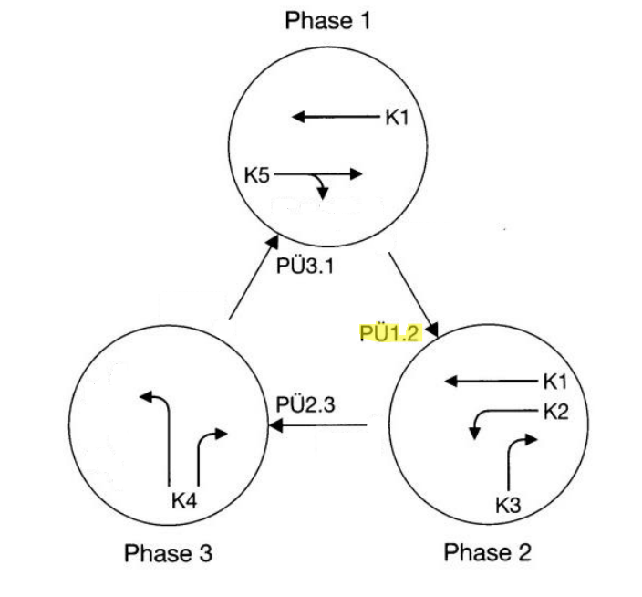
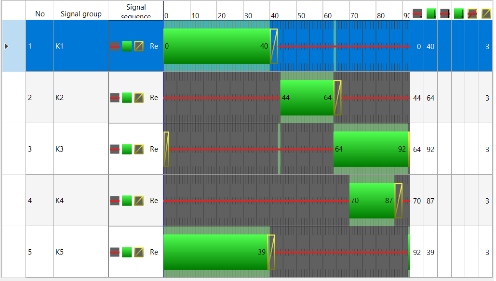
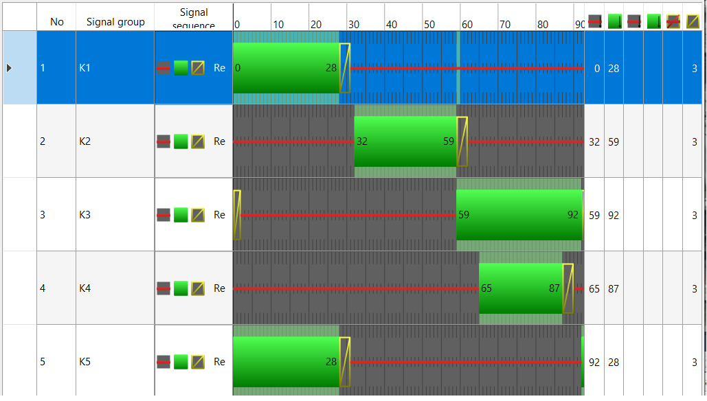

# Traffic-lights-at-T-Junction-in- Zwickau

The following example is an attempt to design a signal controller at an intersection in Zwickau. 

---

---
---

# Intergreen Calculation
**Phase Change**,  **End Group** and **Start Group** columns as specified:

| Phase Change | End Group           | Start Group      |
|--------------|---------------------|------------------|
| 1.2          | K5 (st)                 | K2               |
|              | K5 (st)                 | K3               |
|              | K5 (rt)                 | K2               |
| 2.3          | K1                  | K4               |
|              | K2                  | K4               |
| 3.1          | K4 (lt)             | K1               |
|              | K4 (lt)             | K5 (st)          |
|              | K4 (lt)             | K5 (rt)          |
|              | K4 (rt)             | K5 (st)          |

## Calculation of intergreen time

| Phase Change | End Group           | Start Group      | S0  | Lfz | Vr  | Tr   | Tü | Se | Ve    | Te   |
|--------------|---------------------|------------------|-----|-----|-----|------|----|----|-------|------|
| 1.2          | K5 (st)                 | K2               | 15  | 6   | 10  | 2.1  | 3  | 18 | 11.11 | 1.63 |
|              | K5 (st)                 | K3               | 17  | 6   | 10  | 2.3  | 3  | 16 | 11.11 | 1.44 |
|              | K5 (rt)                 | K2               | 10  | 6   | 5   | 3.2  | 2  | 40 | 11.11 | 3.6  |
| 2.3          | K1                  | K4               | 23  | 6   | 10  | 2.9  | 3  | 15 | 11.11 | 1.35 |
|              | K2                  | K4               | 15  | 6   | 7   | 3.0  | 2  | 10 | 11.11 | 0.9  |
| 3.1          | K4 (lt)             | K1               | 30  | 6   | 7   | 5.14 | 2  | 20 | 11.11 | 1.8  |
|              | K4 (lt)             | K5 (st)          | 22  | 6   | 7   | 4.0  | 2  | 11 | 11.11 | 1.0  |
|              | K4 (rt)             | K5 (st)          | 25  | 6   | 7   | 4.4  | 2  | 17 | 11.11 | 1.53 |

---

### Intergreen Matrix

|     | K1 | K2 | K3 | K4 | K5 |
|-----|----|----|----|----|----|
| **K1** |  - | X  | X  | 5  | X  |
| **K2** | X  | -  | X  | 6  | X  |
| **K3** | X  | X  | -  | X  | X  |
| **K4** | 6  | X  | X  | -  | 5  |
| **K5** | X  | 4  | 4  | X  | -  |

### Explanation:
- Each row and column corresponds to a signal (K1, K2, K3, K4, K5).
- The **X** entries show which signals can work together at the same time.

---

Choose 90 seconds as cycle time:

Qb.Tu= Qs.Tf
Tf= Qb.Tu/0.9.Qs

After calculations:

K1= 20 seconds
K2= 20 seconds
K3= 18 seconds
K4= 18 seconds
K5= 40 seconds

After running simulations optimizing the timing:

